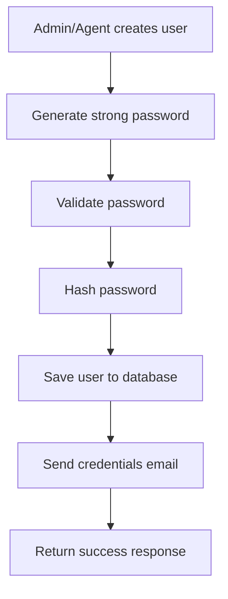
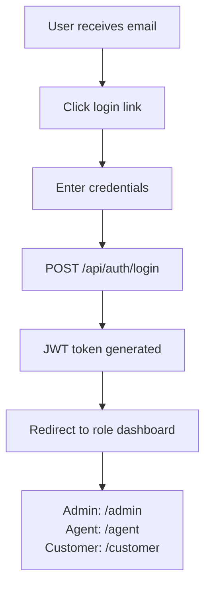

# Role-Based User Onboarding System

## Overview
Comprehensive role-based user onboarding system with automatic credential generation and email delivery for  CRM.

## 🎯 Features

### ✅ **User Creation Rules**
- **Admin** can create: Agents, Customers
- **Agent** can create: Customers
- **Customer** cannot create other users

### ✅ **Automatic Credential Generation**
- Strong 12-character passwords with mixed case, numbers, and symbols
- Password validation using `@jaimilgorajiya/password-utils`
- Secure password hashing before storage
- No plain text password storage or logging

### ✅ **Email Delivery**
- Professional HTML email templates
- Immediate email delivery after user creation
- Includes login credentials and direct login links
- Branded with  CRM identity

### ✅ **Role-Based Authentication**
- Unified login API: `POST /api/auth/login`
- JWT tokens with user ID and role
- Automatic dashboard redirection based on role

## 🚀 **New API Endpoints**

### User Creation
```javascript
// Create Agent (Admin only)
POST /api/users/agents
Authorization: Bearer <admin_jwt_token>
{
  "name": "Agent Name",
  "email": "agent@example.com",
  "mobile": "+1234567890"
}

// Create Customer (Admin and Agent)
POST /api/users/customers
Authorization: Bearer <admin_or_agent_jwt_token>
{
  "name": "Customer Name", 
  "email": "customer@example.com",
  "mobile": "+1234567890"
}

// Get Users by Role
GET /api/users/{role}
Authorization: Bearer <jwt_token>
// role can be: admin, agent, customer
```

### Response Format
```json
{
  "success": true,
  "message": "User created successfully. Credentials sent via email.",
  "data": {
    "user": {
      "id": "user_id",
      "name": "User Name",
      "email": "user@example.com",
      "role": "agent|customer",
      "status": "active",
      "createdAt": "2026-01-22T..."
    },
    "tempPassword": "TempPass123!" // For development/testing only
  }
}
```

## 🔐 **Authentication Flow**

### 1. User Creation


### 2. Login Process


## 📧 **Email Configuration**

### Environment Variables
```env
# Email Configuration
SMTP_HOST=smtp.gmail.com
SMTP_PORT=587
SMTP_SECURE=false
SMTP_USER=your-email@gmail.com
SMTP_PASS=your-app-password

# Frontend URL for email links
FRONTEND_URL=http://localhost:5173
```

### Email Content
- **Subject**: Welcome to  CRM - Your {Role} Account
- **Content**: Professional HTML template with:
  - Welcome message with user's name and role
  - Login credentials (email and temporary password)
  - Direct login link to appropriate dashboard
  - Security warnings and instructions
  - Branded  CRM styling

## 🛡️ **Security Features**

### Password Security
- 12-character minimum length
- Mixed case letters, numbers, and symbols
- Validation using `@jaimilgorajiya/password-utils`
- Secure hashing with bcrypt
- No plain text storage

### Authorization
- JWT-based authentication
- Role-based access control
- Route protection middleware
- Proper HTTP status codes

### Data Protection
- Passwords never logged or exposed
- Secure cookie configuration
- Environment-based configuration
- Input validation and sanitization

## 🏗️ **Architecture**

### Service Layer
```
backend/services/
├── userService.js      # User creation logic
└── emailService.js     # Email delivery logic
```

### Controllers
```
backend/controllers/
├── auth.controllers.js           # Unified authentication
├── userCreation.controllers.js   # New user creation
├── admin.controllers.js          # Updated admin functions
├── agent.controllers.js          # Updated agent functions
└── customer.controllers.js       # Updated customer functions
```

### Routes
```
backend/routes/
├── auth.routes.js           # Authentication endpoints
├── userCreation.routes.js   # User creation endpoints
├── admin.routes.js          # Admin management
├── agent.routes.js          # Agent management
└── customer.routes.js       # Customer management
```

## 🧪 **Testing**

### Manual Testing
```bash
# 1. Create an agent (as admin)
curl -X POST http://localhost:5000/api/users/agents \
  -H "Content-Type: application/json" \
  -H "Authorization: Bearer <admin_token>" \
  -d '{"name":"Test Agent","email":"agent@test.com","mobile":"1234567890"}'

# 2. Login with generated credentials
curl -X POST http://localhost:5000/api/auth/login \
  -H "Content-Type: application/json" \
  -d '{"email":"agent@test.com","password":"<generated_password>"}'

# 3. Create customer (as agent)
curl -X POST http://localhost:5000/api/users/customers \
  -H "Content-Type: application/json" \
  -H "Authorization: Bearer <agent_token>" \
  -d '{"name":"Test Customer","email":"customer@test.com"}'
```

### Email Testing
1. Check email delivery in SMTP logs
2. Verify email content and formatting
3. Test login links in emails
4. Confirm credentials work for login

## 📋 **Migration from Old System**

### Backward Compatibility
- Old registration endpoints still work
- Existing users can login normally
- Gradual migration to new system

### New vs Old Endpoints
```javascript
// OLD (still works)
POST /api/agent/register
POST /api/customer/register

// NEW (recommended)
POST /api/users/agents
POST /api/users/customers
```

## 🔄 **Frontend Integration**

### Required Frontend Changes
1. **Admin Dashboard**: Add user creation forms
2. **Agent Dashboard**: Add customer creation form
3. **Login Flow**: Use unified `/api/auth/login`
4. **Role Routing**: Redirect based on user role after login

### Example Frontend Flow
```javascript
// Login
const response = await fetch('/api/auth/login', {
  method: 'POST',
  headers: { 'Content-Type': 'application/json' },
  body: JSON.stringify({ email, password })
});

const { data } = await response.json();
const { user, accessToken } = data;

// Redirect based on role
switch(user.role) {
  case 'admin': navigate('/admin'); break;
  case 'agent': navigate('/agent'); break;
  case 'customer': navigate('/customer'); break;
}
```

## 🚨 **Important Notes**

1. **Email Configuration**: Ensure SMTP credentials are properly configured
2. **Password Security**: Temporary passwords are only shown in API response for development
3. **Role Permissions**: Strictly enforced at API level
4. **Database**: Uses unified `users` collection with role field
5. **Status**: All new users created with "active" status by default

## 🎉 **Benefits**

- **Simplified Onboarding**: One-click user creation with automatic setup
- **Professional Experience**: Branded emails with clear instructions
- **Security First**: Strong passwords and proper validation
- **Scalable Architecture**: Clean service-based design
- **Role-Based Access**: Proper authorization at every level
- **Email Automation**: No manual credential sharing needed